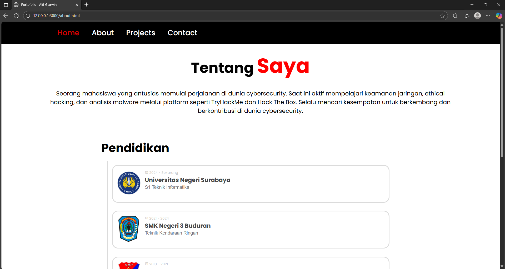
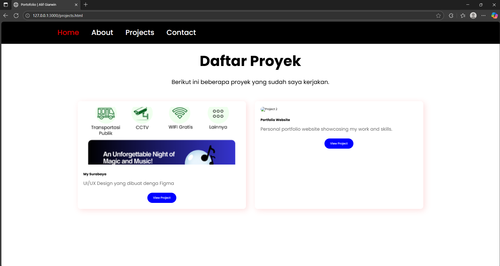

# Portofolio-Alif-PBP 23-10-2025

Proyek ini adalah halaman portfolio sederhana dengan menerapkan html/css/js.  
Struktur terdiri dari empat halaman utama:

- home.html – Landing/Portfolio (Home, About, Projects, Contact)
- about.html – (Tentang Saya, Pendidikan, Pengalaman, Keahlian)
- project.html – (memasukkan project-project yang telah dibuat)
- kontak.html – • Kerjasama • Kontak (company/profile style dengan call-to-action)

---

## 🖼 Screenshoot

### 1) Home / Landing (home.html)
*Desktop*

---

### 2) About (about.html)

*About*

*Penjelasan*  

Tampilan Tampilan Tersebut merupakan hasil gambar dari bagaian web ketika di scroll
---

### 3) Projects (Project.html)

*Penjelasan*  
- Ringkasan kontribusi, streak

---

### 4) • Kerjasama • Kontak (kontak.html)

*Penjelasan*  
- Halaman profil ringkas: nilai utama, keahlian, pengalaman, pendidikan. Ada CTA *Ajukan Kerjasama* & *Hubungi Kami*.

---

## 📹 Demo Video

Tonton demo lengkap di YouTube: **(https://youtu.be/jtCvg793BS4?si=zRLOtNygoIXlUU6W)**

