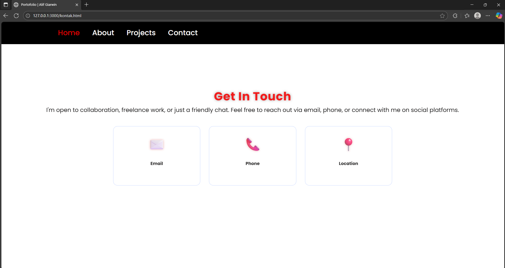

# Portofolio-Alif-PBP 23-10-2025

Proyek ini adalah halaman portfolio sederhana dengan menerapkan html/cs/js.  
Struktur terdiri dari empat halaman utama:

- home.html – Landing/Portfolio (Home, About, Technical Skill, Projects, Contact)
- about.html – Statistik Keaktifan (grafik/laporan singkat aktivitas & bahasa yang sering dipakai)
- project.html – Project • Kerjasama • Kontak (company/profile style dengan call-to-action)
- kontak.html – Contact • Kerjasama • Kontak (company/profile style dengan call-to-action)

---

## 🖼 Screenshoot

### 1) Home / Landing (home.html)
*Desktop*

---

### 2) About (about.html)

*About*

*Penjelasan*  

Tampilan Tampilan Tersebut merupakan hasil gambar dari bagaian web ketika di scroll
---

### 3) Projects (Project.html)

*Penjelasan*  
- Ringkasan kontribusi, streak

---

### 4) Profil • Kerjasama • Kontak (index3.html)

*Penjelasan*  
- Halaman profil ringkas: nilai utama, keahlian, komitmen. Ada CTA *Ajukan Kerjasama* & *Hubungi Kami*.

---

## 🔗 Tautan Penting

- *Halaman utama*: index.html  
- *Statistik*: index2.html  
- *Profil/Kerjasama*: index3.html

---

## 📹 Demo Video

Tonton demo lengkap di YouTube: **(https://youtu.be/jtCvg793BS4?si=9AxCTilfZgazy8c4)**
Menggunakan 4 halaman HTML, serta menggunakan Css, dan JavaScript terdapat sedikit animasi serta mendukung pada tampilan layar 768 Pixel.

pada bagian halaman "Home" terdapat :
1. Foto profil 
2. penjelasan singkat tentang Saya
   
Halaman "About" terdapat :
1. Tentang Saya
2. Pendidikan
3. Pengalaman
4. Keahlian
   
Halaman "Projects" untuk memasukkan project-project yang telah dibuat

halaman "Contact" terdapat:
1. Email jika diklik maka langsung bisa ngirim email ke saya
2. Kontak jika di klik langsung masuk pada "telephon
3. Lokasi

